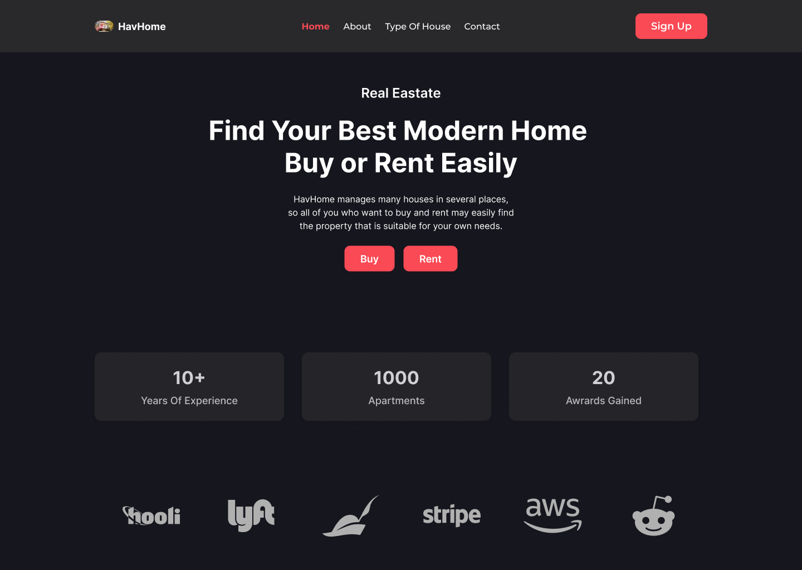
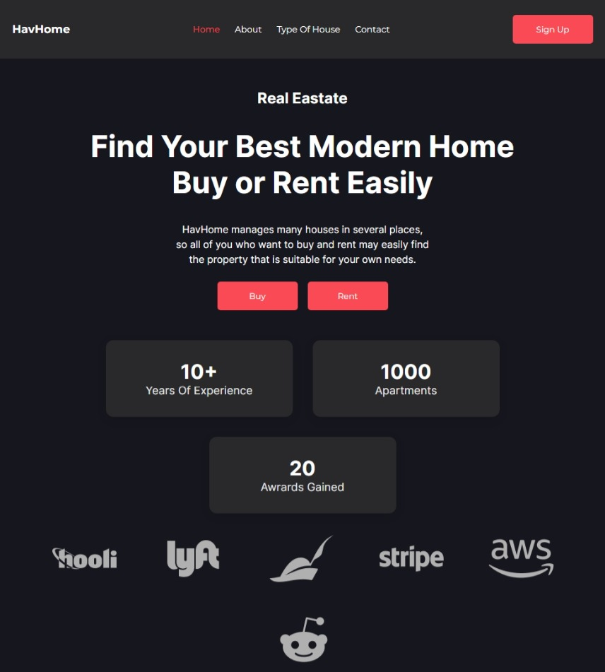
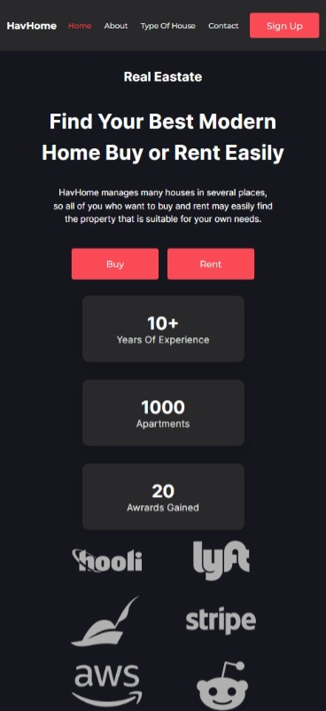

<h1 align="center">Landing page HavHome</h1>

 

 

- [Link do meu perfil](https://github.com/EriickW)
- [Link do site ao vivo]()
- [Minhas redes sociais](https://eriickw.github.io/linktree-main/)

## Screenshots

- ***Desktop***

 

- ***Tablet***

 

- ***Mobile***

